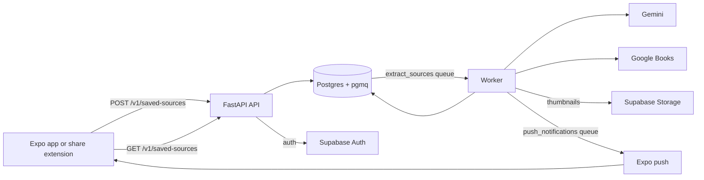

# Mentioned

[](https://github.com/yashdhanore/mentioned/actions/workflows/ci.yml)

Mentioned turns Instagram Reels and posts you save into a list of the books, products, and places they mention.
Share a Reel or post from Instagram (or paste its link) and Mentioned downloads the media, asks Gemini what is being recommended, checks each book against Google Books, and saves the results to your account.

## Extraction quality

Extraction is measured against 22 hand-labeled Reels (131 books), scored as precision and recall with 95% Wilson intervals, cost per correct mention, and latency (`evals/`, `scripts/score_extraction_eval.py`).
Latest run, 2026-09-22:

| Model | Precision | Recall | Cost per 1,000 correct mentions |
| --- | --- | --- | --- |
| `gemini-2.5-flash` (previous production default) | 0.963 | 0.992 | $1.26 |
| `gemini-3.1-flash-lite` (production) | 0.992 | 0.992 | $0.27 |
| `gemini-3.8-flash` | 1.000 | 0.992 | $1.03 |

Error analysis drove the changes: about half of the first run's errors turned out to be labeling mistakes, and most of the rest were places leaking into book Reels ("Turkey" captioned next to a book set there), which a prompt fix cut from 12 to 1 with no loss of recall.
A confidence threshold looked like a free win and was dropped when the next run showed the model's confidence was not stable.
Full results, method, and limits are in [`evals/README.md`](evals/README.md#results).

The step after extraction is measured too: does each book end up attached to the right catalog entry (`scripts/score_resolution_eval.py`)?
On the 126 unique labeled books, hand-checked:

| Strategy | Same work | Collection or bundle | Wrong book | Unresolved |
| --- | --- | --- | --- | --- |
| First Google Books hit (previous production) | 110 | 6 | 6 | 4 |
| Top 5 checked on title and author (production) | 122 | 0 | 0 | 4 |
| Top 5 + tool-using agent for the rest (eval only) | 124 | 1 | 0 | 1 |

The first hit gave 5% of books the wrong cover (a summary, a sequel, a theatre adaptation).
The check removed all of them without losing a book, and a text-only agent that may only pick a volume it has seen in its own searches recovered three of the four it could not confirm, for about half a cent in total.
Details are in [`evals/README.md`](evals/README.md#book-resolution).

## How it works



1. The API validates the URL as a public Instagram Reel or post and maps it to a canonical source such as `instagram:reel:<shortcode>`; a source someone else already saved is linked, not extracted again (`src/sources/identity.py`, `src/sources/service.py`).
2. A new source row and its pgmq message are written in one transaction, so a failed enqueue rolls back the save (`src/sources/queue.py`).
3. The worker claims the source atomically and downloads the media, caption, and thumbnail with `yt-dlp` (`src/extraction/download.py`).
4. A cheap caption and thumbnail check can skip the Gemini call when it is confident there is nothing to find; it fails open on any doubt or error (`src/extraction/relevance.py`).
5. Gemini reads the video and returns book, product, and place mentions in a fixed JSON schema, each with evidence of where it appears (`src/extraction/gemini.py`).
6. Each book is checked against the top five Google Books results on title and author; a book nothing passes keeps its extracted title and gets no cover (`src/books/resolution.py`).
7. The result is written and a push notification is queued in the same transaction, then sent to every user who saved that source (`src/push/`).

## Repository layout

| Path | Contents |
| --- | --- |
| `src/` | FastAPI API, worker, extraction pipeline, book resolution, auth, push, storage. See `src/AGENTS.md`. |
| `migrations/` | Alembic revisions; the source of truth for tables, grants, and row-level security policies. See `docs/adr/0001-alembic-is-the-schema-source-of-truth.md`. |
| `tests/` | Backend pytest suite, mirroring the `src/` layout. |
| `evals/` | Hand-labeled Reels, Reel lists, and results for the extraction and book resolution evals. |
| `scripts/` | Eval tooling, release checks, smoke tests, local dev scripts. |
| `mobile/` | Expo/React Native iOS app and share extension. See `mobile/README.md`. |
| `web/` | Astro landing page and waitlist form. |
| `supabase/` | Supabase CLI config for the local stack, storage buckets, and auth. |
| `docs/` | Deployment runbook, extraction roadmap, architecture decision records, product and technical strategy notes. |

## Known limitations

- There is no retrieval or search over a saved library yet; items are listed per saved Reel.
- The resolution agent runs only in the eval, and evidence is requested from Gemini but not stored yet.
- Place lookup is a stub that always returns nothing (`src/places/enrichment.py`), so places are stored without address or map data.
- The eval set has only book Reels, so it says nothing about recall on place, product, or empty Reels.
- The worker processes one source at a time and runs as a single Render instance (`render.yaml`).
- Only public Instagram Reels and posts are supported.

## Local development (full stack)

Runs the API, worker, web app, and mobile app (Expo web) against a local Supabase with the same queue-based pipeline as production.
You need Docker, the [Supabase CLI](https://supabase.com/docs/guides/local-development/cli/getting-started), [uv](https://docs.astral.sh/uv/), Node 20, and `ffmpeg` (without it, videos over the size limit are sent uncompressed).

```bash
uv sync --frozen --extra dev
cp .env.example .env
# In .env set EXTRACTION_BACKEND=gemini, GEMINI_API_KEY, and GOOGLE_BOOKS_API_KEY
make dev       # starts everything; the first run also installs npm dependencies
make dev-logs  # tail all logs together
make dev-down  # stops everything; local DB state is kept for next time
```

Then open the mobile app at http://localhost:8081, tap +, and paste a public Instagram Reel link; the worker's progress is in `.dev-logs/worker.log`.
Without `EXTRACTION_BACKEND=gemini`, the worker uses a stub that returns zero mentions.
Without `GOOGLE_BOOKS_API_KEY`, Books lookups are rate-limited almost immediately.

`scripts/dev-up.sh` starts Supabase, runs `scripts/local-db-setup.sh` to create the `mentioned_api` and `mentioned_worker` Postgres roles and apply all migrations, and points the API, worker, and mobile app at the local stack, so nothing else in `.env` needs to change.
Run outside `make dev` without a `DATABASE_URL`, the API and worker fall back to SQLite, where the worker polls for pending sources instead of reading pgmq.

## Tests and checks

```bash
uv sync --frozen --extra dev
uv run ruff check . && uv run ruff format --check .
uv run pytest
(cd mobile && npm test)  # focused scripts, ESLint, Prettier, tsc
(cd web && npm test)     # astro check, build, Playwright
```

The Postgres role and RLS tests are skipped unless `POSTGRES_TEST_DATABASE_URL`, `POSTGRES_TEST_API_DATABASE_URL`, and `POSTGRES_TEST_WORKER_DATABASE_URL` are set.
CI runs the backend, E2E, mobile, and web checks on every pull request and push to `main` (`.github/workflows/ci.yml`).
The E2E job runs `tests/e2e` against a local Supabase stack and uploads each run's report as the `e2e-reports` artifact.

## API

Production verifies the caller's Supabase access token (`AUTH_MODE=supabase`); local development uses `AUTH_MODE=dev`, which accepts `Authorization: Bearer dev:<uuid>` to act as any user.

- `POST /v1/saved-sources` - save an Instagram Reel or post URL.
- `GET /v1/saved-sources` and `GET /v1/saved-sources/{saved_source_id}` - list saved sources, or get one with its status and extracted items.
- `DELETE /v1/saved-sources/{saved_source_id}` - unlink a saved source.
- `DELETE /v1/account` - delete the caller's data and Supabase auth user.
- `POST /v1/push-tokens` and `POST /v1/push-tokens/disable` - register or disable an Expo push token.
- `POST /v1/waitlist` - record a waitlist signup from the landing page.

## Deployment

Mentioned deploys as three Render services (the static web build, the API, and the worker) against one Supabase project.
The worker's pre-deploy step runs the release environment check and then Alembic migrations.
See [`docs/deployment.md`](docs/deployment.md).

## Working with AI agents

`AGENTS.md` files at the root and in nested directories hold the instructions coding agents follow for that part of the codebase; `CLAUDE.md` is a symlink to the root one.
`.agents/` holds shared commands and skills, with `.claude/` and `.cursor/` linked to it so every tool sees the same instructions.
`docs/strategy/` is the running decision log, including approaches that were considered and rejected.
