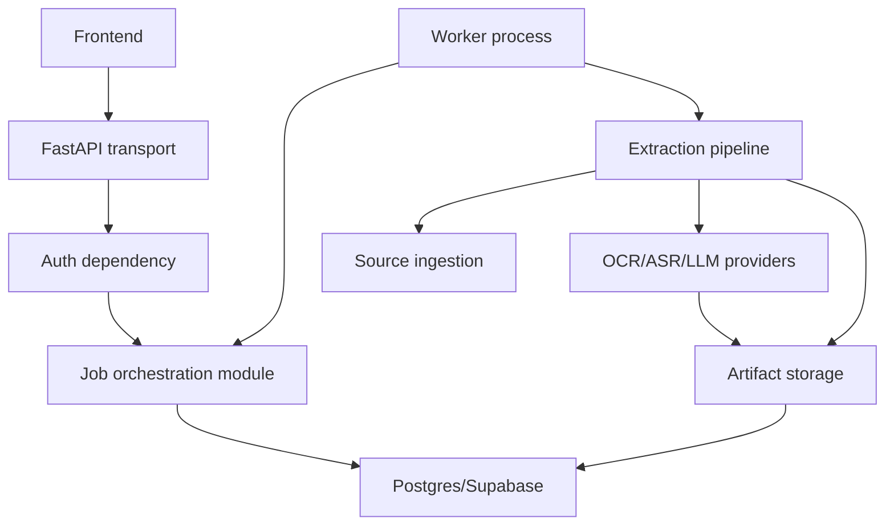

# Mentioned Backend Production Readiness Specification

Status: Draft v4

Last updated: 2026-04-30

Purpose: Define the backend milestone required before building a user-ready frontend for Mentioned.
The extraction pipeline now works well enough to productize. The next backend work is to make job
creation, ownership, persistence, worker execution, and result access durable, secure, and stable.

## Source Basis

This spec is based on:

- The current FastAPI, SQLModel, worker, artifact, and extraction pipeline implementation.
- The current text-first extraction contract in the previous `spec.md`.
- The requested architecture review using:
  - `grill-me`
  - `build-web-apps:supabase-postgres-best-practices`
  - `improve-codebase-architecture`
  - `security-best-practices`
- Supabase/Postgres best-practice guidance for connection pooling, `SKIP LOCKED`, indexes, RLS,
  least privilege, and cursor pagination.
- FastAPI security guidance for auth dependencies, output shaping, CORS, trusted hosts, request
  validation, file/path safety, command execution, and SSRF controls.

## Normative Language

The key words `MUST`, `MUST NOT`, `REQUIRED`, `SHOULD`, `SHOULD NOT`, `RECOMMENDED`, `MAY`, and
`OPTIONAL` in this document are to be interpreted as described in RFC 2119.

`Implementation-defined` means the behavior is part of the implementation contract, but this
specification does not prescribe one universal policy. Implementations MUST document the selected
behavior.

## App End Goal

Mentioned is a personal recommendation capture app.

The end-user goal is:

```text
Paste a social post URL -> understand what was mentioned -> save the useful mentions into a personal library.
```

The first product wedge is public Instagram Reels and posts where creators mention books, products,
places, newsletters, people, or other recommendations in captions, speech, or visible on-screen
text.

The long-term app SHOULD help users:

- Capture recommendations from social posts without manually rewatching or transcribing content.
- See the extracted text and evidence behind each mention.
- Auto-save extracted mentions into a personal, searchable library.
- Review, correct, or delete uncertain auto-saved mentions.
- Organize saved mentions by type, source, creator, status, and user-defined lists.
- Revisit the original source and extraction evidence when trust or context matters.

The backend production-readiness milestone in this spec exists to support that app goal. A frontend
should not be built until the backend can safely create user-owned jobs, process them durably,
return stable results, and protect each user's library and extraction history.

### End Goal Decision Pass

These decisions anchor backend scope before frontend work:

1. What is the product object users ultimately care about?
   - Recommended answer: a saved mention, backed by extraction evidence.
   - Backend implication: extraction jobs are not the final product object; they are the ingestion
     mechanism that produces reviewable mention evidence.

2. Should v1 automatically save extracted mentions into a library?
   - Decision: yes. V1 should auto-save extracted candidate mentions by default.
   - Backend implication: auto-saved library items must keep extraction evidence, confidence,
     source job ID, and an `unreviewed` review status so users can correct or delete them later.

3. Should v1 optimize only for books?
   - Recommended answer: no, but books are the first evaluation-heavy category.
   - Backend implication: schemas should stay generic enough for books, products, places,
     newsletters, people, and unknown categories.

4. What must be trustworthy before the frontend is user-ready?
   - Recommended answer: ownership, job durability, stable result semantics, safe artifact exposure,
     and recoverable worker failures.
   - Backend implication: durable jobs come before library UX, recommendation ranking, or broad
     platform support.

5. Which extracted mentions should auto-save?
   - Decision: every schema-valid candidate mention should auto-save in v1, including low-confidence
     items.
   - Backend implication: confidence and evidence must be visible on the saved mention, and the item
     must remain easy to correct or delete.

6. Should duplicate mentions from different posts be merged?
   - Decision: no. V1 saved mentions are source-specific records.
   - Backend implication: the same book, product, place, or person mentioned in multiple posts
     should produce separate saved mentions because each post has distinct evidence, context, and
     creator framing.

7. Should unreviewed auto-saved mentions be visible immediately?
   - Decision: yes. Auto-saved mentions should appear in the library immediately while marked
     `unreviewed`.
   - Backend implication: the default library list should include active unreviewed items, and APIs
     should support filtering by `review_status` for focused cleanup views.

8. Should deleting a saved mention hard-delete the row?
   - Decision: no. V1 deletion should be a soft delete.
   - Backend implication: delete actions should set `save_state = 'deleted'` so accidental cleanup
     can be undone or audited later.

9. Should user corrections overwrite extracted values?
   - Decision: no. Keep extracted values and user-corrected values separately.
   - Backend implication: saved mentions should preserve extracted fields for evidence/evaluation and
     expose user-editable display fields for the library UI.

10. Should editing a saved mention mark it reviewed?
    - Decision: yes. Editing a saved mention should set `review_status = 'reviewed'`.
    - Backend implication: update endpoints should treat user edits as review actions while keeping
      extracted evidence immutable.

11. Should users be able to confirm without editing?
    - Decision: yes. Users should be able to mark a saved mention as reviewed without changing text.
    - Backend implication: library APIs should support a confirm action that updates only
      `review_status`.

12. Should review status include more than `unreviewed` and `reviewed`?
    - Decision: no. V1 should keep only `unreviewed` and `reviewed`.
    - Backend implication: uncertainty should be surfaced through confidence sorting/filtering
      instead of extra workflow states.

13. Should save state include `archived`?
    - Decision: no. V1 should keep only `active` and `deleted`.
    - Backend implication: archive is a separate product behavior and should not complicate the
      first library state machine.

14. Should v1 support user-defined lists or tags?
    - Decision: no. V1 should use a flat library with filters and search.
    - Backend implication: category, review status, confidence, source fields, and text search are
      enough for the first frontend; lists/tags can be added later.

15. Should v1 include library search?
    - Decision: yes. V1 should support simple Postgres search.
    - Backend implication: search should cover saved mention display fields and stay simple before
      adding advanced ranking or external search infrastructure.

16. Should v1 library search include extraction evidence or debug text?
    - Decision: no. V1 search should use display fields only.
    - Backend implication: evidence/debug search is likely noisy and should remain an advanced or
      internal feature later.

17. Should saved mention categories be arbitrary strings?
    - Decision: no. V1 should use a fixed enum plus `unknown`.
    - Backend implication: category filters stay clean while uncertain extraction can still be saved.

18. Should `unknown` category mentions be hidden by default?
    - Decision: no. `unknown` mentions should be visible immediately like other saved mentions.
    - Backend implication: users can filter by category for cleanup, but the default library list
      should not hide saved items because of category uncertainty.

19. Should users be able to change a saved mention's category?
    - Decision: yes, but only to one of the fixed v1 enum values.
    - Backend implication: correction endpoints may update `category`, but must validate it against
      the same category constraint.

20. Should saved mentions store source creator metadata?
    - Decision: yes, when available.
    - Backend implication: source creator/account metadata should be nullable and captured
      opportunistically for filtering and context.

21. Should users be able to filter by source creator?
    - Decision: yes, when `source_creator` is available.
    - Backend implication: library list endpoints should support source creator filtering and the
      schema should include an owner/source creator index.

22. Should saved mentions denormalize the original source URL?
    - Decision: yes. Store `source_url` directly on each saved mention.
    - Backend implication: library lists can show source links without joining job rows, while
      `source_job_id` still preserves the durable extraction relationship.

23. Should saved mentions denormalize source context text?
    - Decision: yes. Store a nullable short source title/caption snippet.
    - Backend implication: library lists can show why an item was saved without loading the full job
      result, but the snippet should not replace full extraction artifacts.

24. Should the source context snippet be user-editable?
    - Decision: no. The source context snippet should be system-generated and immutable in v1.
    - Backend implication: users edit saved mention display fields, not denormalized source context.

25. Should v1 support auth methods beyond Supabase user auth?
    - Decision: no. V1 should use Supabase user auth only for public user access.
    - Backend implication: API keys are out of scope for v1; worker/service credentials are internal
      and must not become public auth mechanisms.

26. Should rerun create a new job or a new attempt on the same job?
    - Decision: same job, new attempt.
    - Backend implication: `attempt_count`, attempt-scoped artifacts, stage runs, and results must
      preserve rerun history without changing the public `job_id`.

27. How long should frames, audio, crops, and provider outputs be retained?
    - Decision: do not automatically delete them in v1.
    - Backend implication: retain artifacts until an explicit retention, privacy, account deletion,
      or cleanup policy is added later.

28. Should progress use polling, SSE, or WebSockets?
    - Decision: polling only for v1.
    - Backend implication: the job status and result endpoints must be efficient and stable enough
      for frontend polling; realtime transports are deferred.

29. What is the initial v1 abuse/cost guardrail?
    - Decision: use conservative, configurable per-user quotas.
    - Backend implication: default limits should be low enough for an early beta and adjustable from
      configuration as real cost/usage data appears.

## 1. Executive Decision

The first backend milestone before frontend work is:

```text
Durable, user-owned extraction jobs on Postgres with atomic worker claiming.
```

The current pipeline should remain mostly intact. The immediate product risk is not extraction
quality. The immediate product risk is that the frontend would be built against unstable backend
semantics: anonymous jobs, local SQLite setup, non-atomic worker claiming, no durable retries, no
stale-job recovery, and no ownership checks.

This milestone MUST make the backend answer these frontend-critical questions consistently:

- Who owns this job?
- Can this caller see this job?
- What state is the job in?
- Can the job be claimed by only one worker?
- What happens when extraction fails or a worker dies?
- Which result payload is stable enough for the UI to render?

## 2. Product Boundary

Mentioned v1 remains a backend extraction service.

Primary product contract:

```text
Public Instagram Reel/Post URL -> readable text content extracted from the post
```

The backend SHOULD extract:

- Caption/description text where available.
- Spoken audio transcript when ASR is configured.
- Visible text from video frames.
- Visible text from static or carousel post images.
- Multimodal visual reconstruction when a configured provider is available.

The v1 frontend-facing job result API remains text-first. Candidate mentions, title/author pairs,
and visual evidence are extraction evidence, and valid candidate mentions SHOULD be auto-saved into
the user's personal library as unreviewed items. Auto-saved items MUST NOT be treated as canonical
recommendations, rankings, or verified external records.

## 3. Non-Goals For This Milestone

- Building the frontend.
- Adding recommendation rankings, canonical book/product lookup, Goodreads, or external save
  destinations.
- Adding user-defined lists, tags, or folders for saved mentions.
- Adding public API keys or non-Supabase public auth methods.
- Adding SSE, WebSockets, or other realtime progress transports.
- Migrating to a separate queue service such as Celery, Redis, SQS, or Kafka.
- Splitting the backend into microservices.
- Adding support for private Instagram content or Instagram credentials.
- Exposing raw local artifact paths or provider debug payloads to regular frontend users.
- Adding broad TikTok, YouTube Shorts, or generic URL support.

## 4. Current Implementation Baseline

Current endpoints:

- `GET /healthz`
- `POST /v1/jobs/`
- `GET /v1/jobs/{job_id}`
- `GET /v1/jobs/{job_id}/result`
- `POST /v1/jobs/{job_id}/rerun`

Current storage:

- SQLite through SQLModel for local development.
- Local filesystem artifact storage under `data/artifacts/{job_id}`.
- `Job`, `StageRun`, `Artifact`, `TextResult`, and `BookCandidate` SQLModel tables.

Current execution model:

- API creates a queued job.
- Worker polls for the oldest queued job.
- Worker marks it running, calls `run_pipeline`, then records stage runs, artifacts, and result.

Current architectural friction:

- Job lifecycle behavior is spread across `app/models.py`, `app/services/job_service.py`,
  `worker/run.py`, and `extractor/pipeline.py`.
- Worker claiming is a read-then-update sequence and is not safe for multiple workers on Postgres.
- Schema creation uses `SQLModel.metadata.create_all()` instead of migrations.
- Jobs are anonymous and cannot safely power a user-facing frontend.
- Result responses expose implementation-oriented artifact paths and debug values.
- URL fetch/probe/download is user-influenced outbound network and subprocess behavior, so it needs
  stricter allowlisting before public launch.

## 5. Grill-Me Decision Pass

These are the design questions that matter before implementation. The recommended answer is the
answer this spec adopts unless explicitly changed later.

### 5.1 Who owns jobs?

Recommended answer: jobs are owned by a Supabase Auth user.

Rationale: the frontend will need login, job history, result access control, rate limits, and future
library features. Anonymous jobs are useful for local development but are not the production model.

Decision:

- Production jobs MUST have `owner_id`.
- `owner_id` MUST be a Supabase Auth user UUID in production.
- Public user access MUST use Supabase user auth only in v1.
- Local development MAY use a configured dev user ID or a test auth dependency.

### 5.2 Should the backend use Postgres as the queue?

Recommended answer: yes, initially.

Rationale: the job volume and operational needs do not justify a separate queue yet. Postgres can
support safe competing consumers with `FOR UPDATE SKIP LOCKED`, atomic claim/update, retry fields,
and indexes.

Decision:

- The first production worker queue MUST be Postgres-backed.
- The system SHOULD NOT add Redis/Celery/SQS until Postgres queue metrics show real pressure.

### 5.3 Should the frontend call Supabase directly for jobs?

Recommended answer: no for extraction jobs.

Rationale: job creation triggers cost, outbound fetches, subprocesses, OpenAI calls, and policy
checks. These must live behind the FastAPI backend. Supabase Auth issues the user token, but FastAPI
owns job commands and result shaping.

Decision:

- Frontend MUST call FastAPI for job creation, status, rerun, cancel, and result reads.
- FastAPI MUST validate Supabase Auth JWTs.
- Direct Supabase reads MAY be used later for low-risk read models, but are not part of this
  milestone.

### 5.4 Should artifacts move to Supabase Storage now?

Recommended answer: add an artifact storage interface now, keep local storage as the first adapter,
and make Supabase Storage the next adapter.

Rationale: moving storage and job semantics at the same time increases risk. The important contract
is opaque artifact IDs and storage keys, not local filesystem paths.

Decision:

- Public APIs MUST NOT expose local absolute file paths.
- Artifact records MUST store enough metadata to support local and Supabase Storage backends.
- Supabase Storage MAY be implemented after durable jobs.

### 5.5 Should RLS be required immediately?

Recommended answer: design for RLS now, enforce ownership in the repository immediately, and enable
RLS as part of the Supabase migration before public production.

Rationale: FastAPI direct database access needs deliberate user-context handling. RLS is valuable,
but it must be tested with the exact connection role and JWT/user context strategy.

Decision:

- Repository methods MUST filter by `owner_id` for user-scoped reads and writes.
- Production migrations SHOULD enable RLS for user-owned tables.
- The API database role MUST be least-privilege and MUST NOT be a superuser.
- Worker/service roles MAY bypass user RLS only for internal job execution paths.

### 5.6 What is the user-ready status contract?

Recommended answer: keep the status vocabulary small and stable.

Decision:

- Public statuses MUST be one of:
  - `queued`
  - `running`
  - `succeeded`
  - `partial`
  - `failed`
  - `canceled`
  - `expired`
- Internal stage names MAY be more detailed, but frontend UI logic MUST depend on status and
  stable error codes, not raw tracebacks.

## 6. Target Architecture

The backend SHOULD be organized around these boundaries:

1. Transport layer
   - FastAPI routers and schemas.
   - Auth dependency.
   - Request/response shaping.
   - MUST NOT run extraction work.

2. Job orchestration layer
   - Deep module that owns job lifecycle semantics.
   - Creates jobs, claims jobs, records progress, completes/fails jobs, reruns jobs, cancels jobs,
     and assembles public result views.
   - Hides SQL transactions, status transitions, retries, ownership filters, and stale-lock logic.

3. Extraction pipeline layer
   - Existing pipeline that turns a normalized source URL into a `PipelineResult`.
   - SHOULD remain callable from the worker through a narrow interface.

4. Source ingestion layer
   - URL normalization, platform detection, HTML fetch, probe, download.
   - MUST enforce Instagram-only allowlisting for production.

5. Artifact storage layer
   - Stores source HTML, media, frames, OCR, LLM manifests, provider responses, and result JSON.
   - MUST expose opaque artifact references, not raw filesystem implementation details.

6. Persistence layer
   - Postgres/Supabase schema, migrations, indexes, constraints, RLS, and roles.

7. Observability layer
   - Structured logs, stage runs, provider usage, job events, metrics, and trace/correlation IDs.



## 7. Deep Module Refactor Target

The first architectural refactor SHOULD deepen the job lifecycle module.

Cluster:

- `app/models.py`
- `app/services/job_service.py`
- `worker/run.py`
- `app/routers/jobs.py`
- `app/routers/results.py`
- `extractor/types.py`

Why they are coupled:

- They co-own status transitions, job ownership, result assembly, artifact persistence, and worker
  execution semantics.
- The worker currently knows too much about how job rows, stage rows, artifact rows, and text
  result rows are persisted.
- Routes currently call low-level job service functions directly.

Dependency category:

- Local-substitutable for repository behavior when tested against local Postgres/Supabase.
- True external for OpenAI, yt-dlp, ffmpeg, and network fetches, which should remain mocked or
  adapter-bound at the extraction boundary.

Target shape:

```python
class JobCoordinator:
    def create_job(self, owner_id: str, source_url: str, idempotency_key: str | None) -> JobView: ...
    def get_job(self, owner_id: str, job_id: str) -> JobView | None: ...
    def get_result(self, owner_id: str, job_id: str) -> JobResultView | None: ...
    def claim_next_job(self, worker_id: str) -> ClaimedJob | None: ...
    def record_pipeline_result(self, claimed_job: ClaimedJob, result: PipelineResult) -> None: ...
    def auto_save_mentions(self, claimed_job: ClaimedJob, result: PipelineResult) -> list[SavedMentionView]: ...
    def fail_claimed_job(self, claimed_job: ClaimedJob, error: JobFailure) -> None: ...
```

The exact interface MAY change during implementation, but the module MUST hide transaction details,
`SKIP LOCKED`, retries, owner filters, stale locks, and result serialization.

Boundary tests SHOULD replace shallow tests around individual persistence helper functions.

## 8. Public API Contract

All protected endpoints MUST require authenticated caller context unless explicitly marked public.

### 8.1 Create Job

`POST /v1/jobs`

Request:

```json
{
  "url": "https://www.instagram.com/reel/...",
  "idempotency_key": "optional-client-generated-key"
}
```

Response: `202 Accepted`

```json
{
  "job_id": "uuid",
  "source_url": "https://www.instagram.com/reel/...",
  "source_kind": "instagram_reel",
  "status": "queued",
  "current_stage": null,
  "progress": 0.0,
  "error": null,
  "created_at": "2026-04-30T00:00:00Z",
  "updated_at": "2026-04-30T00:00:00Z",
  "links": {
    "self": "/v1/jobs/{job_id}",
    "result": "/v1/jobs/{job_id}/result"
  }
}
```

Rules:

- The request schema MUST reject unknown fields.
- The URL MUST normalize to a supported Instagram Reel/Post URL before a job is created.
- `idempotency_key`, when supplied, MUST be unique per owner.
- Duplicate idempotency keys SHOULD return the existing job response.

### 8.2 Get Job

`GET /v1/jobs/{job_id}`

Rules:

- Caller MUST own the job or have an internal service role.
- Unknown or unauthorized jobs SHOULD return `404` to avoid leaking job existence.
- Response MUST include stable public status and error code.

### 8.3 List Jobs

`GET /v1/jobs?limit=20&cursor=...`

Rules:

- This endpoint SHOULD be added before frontend job history work.
- Pagination MUST be cursor/keyset-based, not offset-based.
- Default limit SHOULD be 20.
- Maximum limit SHOULD be 100.
- Sort order SHOULD be newest first by `(created_at, id)`.

### 8.4 Get Result

`GET /v1/jobs/{job_id}/result`

Response shape:

```json
{
  "job_id": "uuid",
  "source_url": "https://www.instagram.com/reel/...",
  "source_kind": "instagram_reel",
  "status": "succeeded",
  "current_stage": "completed",
  "progress": 1.0,
  "text": {
    "caption_text": "...",
    "spoken_text": null,
    "visual_text": "...",
    "image_text": null,
    "merged_text": "...",
    "warnings": [],
    "debug": null
  },
  "artifacts": [],
  "stage_runs": []
}
```

Rules:

- Regular frontend users SHOULD receive `debug: null` by default.
- Internal/debug mode MAY expose sanitized debug summaries.
- Raw provider responses, request headers, API keys, local absolute paths, and raw tracebacks MUST
  NOT be returned.
- Artifact responses MUST use opaque IDs or signed URLs with authorization checks.

### 8.5 Rerun Job

`POST /v1/jobs/{job_id}/rerun`

Rules:

- Caller MUST own the job.
- Rerun MUST only be allowed from terminal states: `succeeded`, `partial`, `failed`, `canceled`,
  or `expired`.
- Rerun MUST create a new attempt under the same public `job_id`.
- Attempt-scoped stage runs, artifacts, provider calls, and saved mention auto-save writes MUST
  remain attributable to the attempt that produced them.
- Prior artifacts MUST NOT be destructively deleted by v1 reruns.

### 8.6 Cancel Job

`POST /v1/jobs/{job_id}/cancel`

Rules:

- Cancel SHOULD be supported before frontend launch.
- Queued jobs MUST transition to `canceled`.
- Running jobs SHOULD be marked cancel-requested and transition to `canceled` at a cooperative
  checkpoint, or finish normally if cancellation is not safe.

## 9. Error Contract

Public errors MUST be stable and non-sensitive.

Recommended public error codes:

- `invalid_source_url`
- `unsupported_source_kind`
- `source_fetch_failed`
- `source_probe_failed`
- `source_download_failed`
- `media_processing_failed`
- `asr_failed`
- `ocr_failed`
- `visual_reconstruction_failed`
- `no_text_extracted`
- `pipeline_error`
- `job_canceled`
- `job_expired`
- `rate_limited`
- `quota_exceeded`

Rules:

- Public `error_message` SHOULD be human-readable but generic.
- Internal exception strings SHOULD be stored in internal logs or internal-only diagnostic columns.
- Provider errors SHOULD be normalized to the public taxonomy.

## 10. Postgres/Supabase Schema

The production schema MUST be managed by migrations. Runtime app startup MUST NOT create or mutate
tables with `SQLModel.metadata.create_all()`.

### 10.1 Primary Keys

- Public resource IDs MUST be opaque.
- UUIDv7 is RECOMMENDED for new Postgres primary keys when available.
- UUIDv4 MAY be used for compatibility if UUIDv7 is not available.
- Sequential integer IDs MUST NOT be exposed as public job IDs.

### 10.2 Tables

#### `jobs`

Required fields:

- `id uuid primary key`
- `owner_id uuid not null`
- `source_url text not null`
- `source_kind text not null`
- `status text not null`
- `current_stage text null`
- `progress numeric(5,4) not null default 0`
- `priority integer not null default 0`
- `attempt_count integer not null default 0`
- `max_attempts integer not null default 3`
- `locked_by text null`
- `locked_at timestamptz null`
- `heartbeat_at timestamptz null`
- `started_at timestamptz null`
- `finished_at timestamptz null`
- `next_run_at timestamptz not null default now()`
- `cancel_requested_at timestamptz null`
- `error_code text null`
- `error_message text null`
- `internal_error text null`
- `idempotency_key text null`
- `created_at timestamptz not null default now()`
- `updated_at timestamptz not null default now()`

Required constraints:

- `status` MUST be constrained to the public status vocabulary.
- `progress` MUST be between `0` and `1`.
- `attempt_count` MUST be greater than or equal to `0`.
- `max_attempts` MUST be greater than or equal to `1`.
- `(owner_id, idempotency_key)` MUST be unique where `idempotency_key is not null`.

#### `job_stage_runs`

Required fields:

- `id uuid primary key`
- `job_id uuid not null references jobs(id) on delete cascade`
- `attempt_number integer not null`
- `stage text not null`
- `success boolean not null`
- `duration_ms integer not null`
- `payload jsonb null`
- `error_code text null`
- `error_text text null`
- `created_at timestamptz not null default now()`

#### `artifacts`

Required fields:

- `id uuid primary key`
- `job_id uuid not null references jobs(id) on delete cascade`
- `attempt_number integer not null`
- `kind text not null`
- `storage_backend text not null`
- `storage_key text not null`
- `media_type text null`
- `byte_size bigint null`
- `sha256 text null`
- `metadata jsonb null`
- `created_at timestamptz not null default now()`

Rules:

- `storage_key` MUST be opaque from the public API perspective.
- Local absolute paths MUST NOT be returned to regular users.
- Artifact metadata MUST NOT contain secrets.

#### `text_results`

Required fields:

- `job_id uuid primary key references jobs(id) on delete cascade`
- `attempt_number integer not null`
- `caption_text text null`
- `spoken_text text null`
- `visual_text text null`
- `image_text text null`
- `merged_text text not null`
- `warnings jsonb not null default '[]'`
- `debug jsonb null`
- `created_at timestamptz not null default now()`
- `updated_at timestamptz not null default now()`

#### `provider_calls`

Recommended fields:

- `id uuid primary key`
- `job_id uuid not null references jobs(id) on delete cascade`
- `attempt_number integer not null`
- `stage text not null`
- `provider text not null`
- `model text null`
- `success boolean not null`
- `duration_ms integer not null`
- `input_token_count integer null`
- `output_token_count integer null`
- `input_image_count integer null`
- `estimated_cost_usd numeric(12,6) null`
- `error_code text null`
- `error_text text null`
- `metadata jsonb null`
- `created_at timestamptz not null default now()`

#### `saved_mentions`

Required for the auto-save v1 library behavior.

Required fields:

- `id uuid primary key`
- `owner_id uuid not null`
- `source_job_id uuid not null references jobs(id) on delete cascade`
- `source_artifact_id uuid null references artifacts(id) on delete set null`
- `category text not null`
- `display_label text not null`
- `display_author_or_creator text null`
- `display_description text null`
- `extracted_label text not null`
- `extracted_author_or_creator text null`
- `extracted_description text null`
- `source_url text not null`
- `source_platform text not null default 'instagram'`
- `source_creator text null`
- `source_context_snippet text null`
- `evidence_text text null`
- `evidence jsonb not null default '{}'`
- `confidence numeric(4,3) null`
- `candidate_fingerprint text not null`
- `save_state text not null default 'active'`
- `review_status text not null default 'unreviewed'`
- `created_by text not null default 'extraction'`
- `created_at timestamptz not null default now()`
- `updated_at timestamptz not null default now()`

Rules:

- Auto-saved mentions MUST preserve the source job and evidence that produced them.
- Auto-saved mentions MUST denormalize `source_url` from the source job for cheap library reads.
- Auto-saved mentions SHOULD denormalize a short `source_context_snippet` when caption/title context
  is available.
- `source_context_snippet` SHOULD be system-generated and immutable in v1.
- `source_creator` SHOULD be stored when available but MUST NOT be required for auto-save.
- `category` MUST be constrained to `book`, `product`, `place`, `newsletter`, `person`, or
  `unknown` in v1.
- Auto-saved mentions MUST default to `review_status = 'unreviewed'`.
- `review_status` MUST be constrained to `unreviewed` or `reviewed` in v1.
- Auto-saved mentions MUST keep extracted fields separate from user-editable display fields.
- User corrections MUST update display fields, not overwrite extracted evidence fields.
- User corrections MAY update `category`, but only to a valid v1 category enum value.
- User corrections MUST set `review_status = 'reviewed'`.
- A confirm action SHOULD set `review_status = 'reviewed'` without changing display or extracted
  fields.
- Auto-save MUST NOT apply a confidence threshold in v1; every schema-valid candidate mention MUST
  be saved with its confidence and evidence.
- Auto-saved mentions MUST be visible in normal library lists immediately unless the caller requests
  a filter that excludes `unreviewed` items.
- `unknown` category mentions MUST follow the same default visibility rules as other categories.
- Users MUST be able to delete or correct auto-saved mentions in a later frontend/library flow.
- `save_state` MUST be constrained to `active` or `deleted` in v1.
- User delete actions MUST soft-delete by setting `save_state = 'deleted'`; normal library lists
  MUST default to `save_state = 'active'`.
- Hard deletion SHOULD be reserved for retention, privacy, or account-deletion workflows.
- Auto-save writes MUST be idempotent per source job and candidate fingerprint across attempts so
  reruns do not create duplicate library items for the same extracted candidate.
- Auto-save MUST NOT deduplicate or merge mentions across different source jobs, even when label,
  author, or category appears to match.
- Auto-saved mentions MUST NOT claim canonical external identity unless a later canonicalization
  feature adds verified fields.
- V1 search SHOULD query `display_label`, `display_author_or_creator`, and `display_description`.
- V1 search SHOULD use Postgres text search or indexed `ilike`-style matching; external search
  infrastructure SHOULD NOT be added for the first frontend.

### 10.3 Required Indexes

Indexes MUST match actual query patterns.

Required indexes:

```sql
create index jobs_owner_created_id_idx
  on jobs (owner_id, created_at desc, id desc);

create index jobs_queued_claim_idx
  on jobs (status, next_run_at, priority desc, created_at, id)
  where status = 'queued';

create index jobs_running_heartbeat_idx
  on jobs (status, heartbeat_at)
  where status = 'running';

create index job_stage_runs_job_created_idx
  on job_stage_runs (job_id, created_at, id);

create index artifacts_job_kind_created_idx
  on artifacts (job_id, kind, created_at, id);

create index provider_calls_job_created_idx
  on provider_calls (job_id, created_at, id);

create index saved_mentions_owner_created_id_idx
  on saved_mentions (owner_id, created_at desc, id desc);

create index saved_mentions_owner_category_created_idx
  on saved_mentions (owner_id, category, created_at desc, id desc);

create index saved_mentions_owner_creator_created_idx
  on saved_mentions (owner_id, source_creator, created_at desc, id desc)
  where source_creator is not null;

create index saved_mentions_source_job_idx
  on saved_mentions (source_job_id);

create unique index saved_mentions_source_candidate_uidx
  on saved_mentions (source_job_id, candidate_fingerprint);

create index saved_mentions_search_idx
  on saved_mentions using gin (
    to_tsvector(
      'simple',
      coalesce(display_label, '') || ' ' ||
      coalesce(display_author_or_creator, '') || ' ' ||
      coalesce(display_description, '')
    )
  );
```

Foreign key columns MUST be indexed. Composite indexes SHOULD place equality columns before range
columns.

## 11. Worker Queue Semantics

### 11.1 Atomic Claim

Workers MUST claim jobs with a single atomic update using row locking and `SKIP LOCKED`.

Conceptual SQL:

```sql
update jobs
set
  status = 'running',
  locked_by = :worker_id,
  locked_at = now(),
  heartbeat_at = now(),
  started_at = coalesce(started_at, now()),
  attempt_count = attempt_count + 1,
  current_stage = 'claimed',
  progress = 0.01,
  updated_at = now()
where id = (
  select id
  from jobs
  where status = 'queued'
    and next_run_at <= now()
    and attempt_count < max_attempts
  order by priority desc, created_at, id
  limit 1
  for update skip locked
)
returning *;
```

Rules:

- Multiple workers MUST NOT be able to claim the same job.
- Claim transactions MUST be short.
- Extraction work MUST run outside the claim transaction.
- Worker identity MUST be recorded.

### 11.2 Heartbeats And Stale Jobs

Workers SHOULD update `heartbeat_at` during long-running jobs.

A running job is stale when:

```text
status = 'running' and heartbeat_at < now() - stale_job_timeout
```

Stale jobs SHOULD be requeued if attempts remain. Stale jobs MUST be marked `failed` or `expired`
when attempts are exhausted.

### 11.3 Retries

Retry policy:

- Default `max_attempts`: 3.
- Retryable failures SHOULD use exponential backoff with jitter.
- Permanent validation failures MUST NOT retry.
- Provider/network/media failures MAY retry if classified retryable.
- Final failure MUST preserve a stable public `error_code`.

### 11.4 Idempotency

Job creation SHOULD support client-supplied idempotency keys.

Rules:

- Idempotency keys are scoped to `owner_id`.
- Replays with the same key SHOULD return the original job.
- Replays with the same key but different normalized URL SHOULD return `409 Conflict`.

## 12. Auth, Authorization, And RLS

### 12.1 Auth Strategy

Production API requests MUST authenticate with a Supabase Auth bearer token.

Rules:

- Auth MUST be implemented as a FastAPI dependency.
- Protected routers SHOULD attach auth at the router boundary.
- Auth tokens MUST NOT be accepted in query parameters.
- Public API keys MUST NOT be supported in v1.
- Unknown, invalid, or expired tokens MUST return `401`.
- Existing jobs owned by another user SHOULD return `404`, not `403`, to avoid existence leaks.

### 12.2 Authorization Strategy

Repository methods MUST require caller context:

```python
@dataclass(frozen=True)
class Caller:
    subject_id: str
    role: Literal["user", "worker", "admin"]
```

Rules:

- User callers MUST be scoped to `owner_id = caller.subject_id`.
- Worker callers MAY claim queued jobs across owners but MUST not expose results to users.
- Admin/debug capabilities MUST be explicit and auditable.

### 12.3 RLS Strategy

Production Supabase tables containing user-owned data SHOULD enable RLS.

RLS rules:

- Users can read/write only rows where `owner_id = auth.uid()` or equivalent app user context.
- Service/worker roles MAY bypass user RLS through dedicated least-privilege roles.
- RLS policy columns, especially `owner_id`, MUST be indexed.
- RLS functions SHOULD be wrapped in `select` when applicable to avoid per-row function overhead.
- The project MUST document whether FastAPI direct DB access uses Supabase JWT/RLS context, explicit
  owner filters, or both.

## 13. FastAPI Security Requirements

### 13.1 Production App Configuration

- Production MUST NOT run with auto-reload.
- Production MUST NOT enable debug tracebacks.
- `/docs`, `/redoc`, and `/openapi.json` SHOULD be disabled or protected in production.
- Trusted hosts MUST be configured in app or at the edge.
- CORS MUST use an explicit frontend origin allowlist.
- Request size limits MUST be enforced at the edge and, where relevant, in app validation.

### 13.2 Request And Response Models

- Write request models MUST reject unknown fields.
- Response models MUST be separate from database models.
- Sensitive internal fields MUST NOT be returned by default.
- `debug` output MUST be opt-in and sanitized.

### 13.3 SSRF Controls

Instagram URL ingestion is user-influenced outbound network behavior. Production MUST implement
SSRF controls before public launch.

Requirements:

- Only `https` SHOULD be accepted in production.
- Hostnames MUST be allowlisted to exact known Instagram hosts, such as `instagram.com` and
  `www.instagram.com`.
- Hostname matching MUST NOT accept attacker-controlled suffixes such as
  `instagram.com.evil.example`.
- Redirects MUST be limited and final redirect targets MUST be revalidated.
- Fetches MUST use timeouts.
- Access to localhost, private IP ranges, link-local ranges, and cloud metadata IPs MUST be blocked.
- The same normalized/validated URL MUST be passed to `yt-dlp`.

### 13.4 Subprocess Controls

The backend uses subprocesses for `yt-dlp`, `ffmpeg`, and `tesseract`.

Requirements:

- Subprocess calls MUST pass arguments as lists.
- `shell=True` MUST NOT be used with attacker-influenced values.
- Variable URL/path inputs MUST be validated before subprocess execution.
- Output directories MUST be server-generated and scoped to the job/attempt.

### 13.5 Rate Limits And Quotas

Before public frontend launch:

- Job creation MUST be rate-limited per user and per IP.
- Expensive provider calls MUST have per-user quotas.
- Failed jobs SHOULD count toward abuse controls when they still consume network/provider cost.

Beta per-IP decision:

- The beta implementation SHOULD use edge-level per-IP throttling for `POST /v1/jobs` instead of
  app-level IP throttling, unless the chosen hosting platform cannot enforce route-specific limits.
- The beta threshold MUST be no more than 10 job-create requests per IP per minute.
- The exact edge platform, rule location, and staging verification command are unresolved until beta
  hosting is chosen.
- This unresolved edge-rate-limit configuration is a beta blocker. The backend gate MUST NOT be
  considered complete until the chosen edge rule is documented and verified in staging.

Initial configurable v1 defaults:

- Maximum job creation burst: 3 jobs per user per minute.
- Maximum jobs created: 25 jobs per user per day.
- Maximum active jobs: 5 queued or running jobs per user.
- Maximum multimodal LLM calls: 1 call per job.
- Maximum retry attempts: 3 attempts per job.

Rules:

- Rate-limit failures SHOULD return `429` with public error code `rate_limited`.
- Daily or active-job quota failures SHOULD return `429` with public error code `quota_exceeded`.
- These limits MUST be configuration-driven so they can be lowered or raised after real usage and
  provider-cost data is available.

## 14. Connection Management

The API and worker MUST use connection pooling appropriate for Supabase/Postgres.

Requirements:

- Application traffic SHOULD use the Supabase pooler or equivalent PgBouncer setup.
- Migration traffic SHOULD use a direct database connection when required by migration tooling.
- Transactions MUST be short, especially claim and status updates.
- The worker MUST NOT hold a database transaction while running extraction.
- Pool size MUST be configured deliberately for API and worker processes.
- The app MUST NOT use a superuser database role.

Implementation notes:

- Transaction pooling works best when the app avoids session-level state, temp tables, and
  connection-persistent assumptions.
- If prepared statements conflict with the pooler mode, SQLAlchemy/driver configuration MUST be
  adjusted and documented.

## 15. Artifact Storage Contract

Artifacts include source HTML, metadata, media, audio, frames, crops, OCR JSON, LLM manifests,
provider responses, and final result JSON.

Requirements:

- Artifact records MUST store `storage_backend` and `storage_key`.
- Local storage MUST be an adapter, not hard-coded into public response contracts.
- Supabase Storage SHOULD be the next production adapter after durable jobs.
- Regular user APIs MUST return artifact summaries, opaque IDs, or signed URLs only when authorized.
- Raw local filesystem paths MUST NOT be exposed to regular users.
- V1 MUST NOT automatically delete frames, audio, crops, or provider outputs.
- Automatic deletion SHOULD wait for an explicit retention, privacy, account deletion, or cleanup
  policy.

Recommended storage backends:

- `local` for development.
- `supabase_storage` for production.

## 16. Observability

The backend MUST make job execution explainable without exposing internals to users.

Required:

- Structured logs with `job_id`, `owner_id`, `attempt_number`, `worker_id`, `stage`, and
  correlation/request ID.
- Stage duration records.
- Provider usage records for ASR and multimodal LLM calls.
- Public error code and internal error detail separation.
- Metrics for:
  - jobs created
  - jobs claimed
  - jobs succeeded
  - jobs failed
  - jobs retried
  - stale jobs recovered
  - stage durations
  - provider latency/cost

Health endpoints:

- `GET /healthz` MAY remain shallow.
- `GET /readyz` SHOULD verify database connectivity and migration state before production.

Progress UX:

- V1 frontend progress MUST use polling against job status and result endpoints.
- SSE, WebSockets, push notifications, and webhook-style job completion callbacks are deferred.

## 17. Testing Strategy

### 17.1 Boundary Tests

New tests SHOULD focus on the deep job orchestration boundary:

- Create job stores normalized URL, owner ID, initial status, and idempotency key.
- User cannot read another user's job.
- Claiming is atomic under concurrent workers.
- Claimed job records worker ID, attempt count, heartbeat, and status.
- Pipeline success records stage runs, artifacts, text result, and terminal status.
- Pipeline success auto-saves valid candidate mentions as unreviewed saved mentions.
- Pipeline failure records stable public error and internal diagnostics.
- Stale running job is requeued or failed according to retry policy.
- Rerun behavior preserves or supersedes prior artifacts according to documented policy.

### 17.2 Security Tests

Required security tests:

- Reject non-Instagram hosts.
- Reject suffix spoofing hosts.
- Reject non-HTTP(S), and production SHOULD reject plain HTTP.
- Revalidate redirect final URL.
- Reject unknown request fields.
- Return `404` for unauthorized job IDs.
- Return `404` for unauthorized saved mention IDs when library endpoints are added.
- Ensure artifact responses do not include local absolute paths for regular users.

### 17.3 Database Tests

Postgres-specific tests SHOULD run against local Postgres or Supabase-compatible test database:

- Migration up/down or migration replay.
- Required indexes exist.
- `SKIP LOCKED` claim behavior works.
- RLS policies or explicit owner filters prevent cross-user reads.

SQLite MAY remain useful for narrow local tests, but it MUST NOT be the only verification for
worker claiming or production schema behavior.

## 18. Migration And Rollout Plan

### Phase 1: Spec And Schema Foundation

- Add Alembic or equivalent migration tooling.
- Create production Postgres schema.
- Add job lifecycle fields, owner IDs, constraints, and indexes.
- Add the `saved_mentions` table needed for auto-save library behavior.
- Stop using `create_all()` for production startup.

### Phase 2: Job Orchestration Module

- Introduce the deep job orchestration module.
- Move claim, complete, fail, retry, stale recovery, rerun, and result view logic behind it.
- Add idempotent auto-save behavior for candidate mentions produced by successful jobs.
- Add boundary tests.

### Phase 3: Auth And Ownership

- Add Supabase Auth JWT validation.
- Scope all user endpoints by owner.
- Add local dev auth bypass only through explicit dev configuration.
- Add RLS or document and test explicit owner-filter enforcement.

### Phase 4: Security Hardening

- Harden URL normalization and SSRF controls.
- Add production CORS and trusted host configuration.
- Hide docs in production or protect them.
- Add request model strictness.
- Normalize public error codes.

### Phase 5: Artifact Contract

- Add artifact storage adapter interface.
- Keep local adapter working.
- Replace public path exposure with opaque artifact references.
- Prepare Supabase Storage adapter.

### Phase 6: Library Readiness

- Add owner-scoped saved mention list/read/update/delete endpoints.
- Keep auto-saved mentions marked `unreviewed` until the user edits or explicitly confirms them.
- Mark saved mentions `reviewed` when a user edits display fields.
- Add a confirm action that marks a saved mention `reviewed` without requiring edits.
- Include unreviewed active mentions in the default library list.
- Implement saved mention delete as a soft delete by setting `save_state = 'deleted'`.
- Support a flat library with filtering by `review_status`, `category`, `save_state`, source, and
  confidence.
- Support filtering library lists by `source_creator` when it is present.
- Support simple Postgres text search over saved mention display fields.
- Support sorting library lists by confidence so uncertain items can be reviewed first.
- Use cursor pagination for library lists.
- Preserve source job and evidence references for every saved mention.

### Phase 7: Frontend Readiness Gate

The backend is ready for frontend implementation when:

- Authenticated users can create jobs.
- Users can list, poll, rerun, cancel, and view only their jobs.
- Job progress works through polling only.
- Reruns create a new attempt under the same public job ID.
- Successful jobs auto-save valid candidate mentions into the user's library.
- Users can list, correct, and delete auto-saved mentions.
- V1 quotas/rate limits are enforced and configurable.
- The chosen beta edge enforces `POST /v1/jobs` per-IP throttling at no more than 10 requests per
  minute, with the exact rule and staging verification command documented.
- Worker claiming is safe with multiple workers.
- Stale jobs recover predictably.
- Public result/error payloads are stable.
- Artifact/debug exposure is safe.
- Tests cover the job lifecycle and URL security boundary.

## 19. Open Decisions

These are not blockers for the first implementation, but they must be resolved before public
production:

- Exact Supabase RLS mechanism for FastAPI direct DB connections.
- Long-term retention periods for media, frames, crops, and provider responses.
- Future paid/free quota model after real beta usage and cost data exists.

## 20. First Implementation Task

The first implementation task SHOULD be:

```text
Add Postgres migrations and a durable JobCoordinator with owner-scoped job creation and atomic
SKIP LOCKED worker claiming, plus the saved_mentions table needed by v1 auto-save.
```

Acceptance criteria:

- A migration creates the production job tables, constraints, and indexes.
- The migration creates `saved_mentions` with owner, source job, evidence, confidence, and review
  status fields.
- App startup no longer creates production tables implicitly.
- Jobs have `owner_id` and lifecycle fields.
- Job creation is owner-scoped and idempotency-ready.
- Worker claim is one atomic Postgres statement using `SKIP LOCKED`.
- Two workers cannot claim the same queued job.
- Tests prove owner scoping and claim safety.
